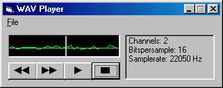



## WAV Sound Graph

### Description

Play a WAV file and see the GRAPHIC wave pattern as it plays! Sort of like the Windows Sound Recorder. This program is small so you can easily understand it, and can use your own customizing talents to make it more special.
 
### More Info
 
I elimated some neccessary ERROR TRAPS and other codes to make the VB coding less confusing. Experienced programmers will know what to do.

             |
---                |---
**Submitted On**   |2000-09-10 21:59:38
**By**             |[Patrick K\. Bigley](https://github.com/Planet-Source-Code/PSCIndex/blob/master/ByAuthor/patrick-k-bigley.md)
**Level**          |Intermediate
**User Rating**    |4.3 (13 globes from 3 users)
**Compatibility**  |VB 4\.0 \(32\-bit\), VB 5\.0, VB 6\.0
**Category**       |[Graphics](https://github.com/Planet-Source-Code/PSCIndex/blob/master/ByCategory/graphics__1-46.md)
**World**          |[Visual Basic](https://github.com/Planet-Source-Code/PSCIndex/blob/master/ByWorld/visual-basic.md)
**Archive File**   |[CODE\_UPLOAD98079102000\.zip](https://github.com/Planet-Source-Code/patrick-k-bigley-wav-sound-graph__1-11399/archive/master.zip)

